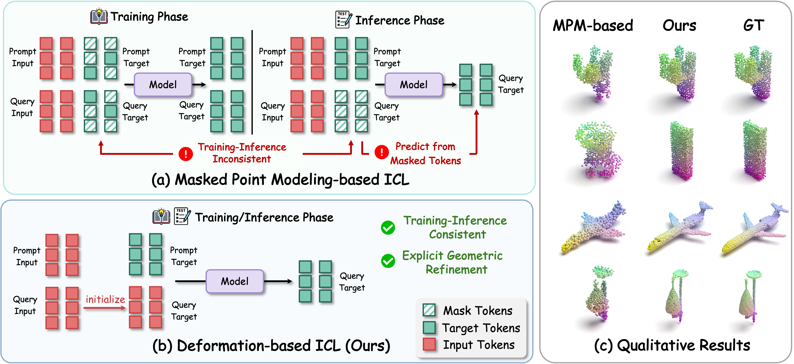

<p align="center">
    <h1 align="center">Deformation-based In-Context Learning for Point Cloud Understanding</h1>
    <p align="center">Chengxing Lin, Jinhong Deng, Yinjie Lei, Wen Li
    <p align="center">CVPR 2026
    <br />
</p>

In this work, we propose **DeformPIC**, a deformation-based point cloud In-Context Learning framework that replaces MPM-style masked reconstruction with task-guided deformation of the query point cloud, enabling explicit geometric reasoning and aligned training/inference objectives. DeformPIC consistently outperforms prior methods, reducing average Chamfer Distance by **1.6/1.8/4.7** on reconstruction/denoising/registration, and achieves state-of-the-art generalization on a new out-of-domain benchmark.



# 🏃‍♀️Run

## 1.Requirements

1. Create virtual environment (python==3.10)
```shell
conda create -n deformpic python=3.10 -y
conda activate deformpic
```
2. Install Pytorch
```shell
# install pytorch and torchvision (pytorch==2.0.0, CUDA==11.8)
pip install torch==2.0.0 torchvision==0.15.1 torchaudio==2.0.1 --index-url https://download.pytorch.org/whl/cu118
```
3. Install reqirements
```shell
# install requirements
pip install -r requirements.txt
pip install einops
pip install ninja
```
4. Compile reqirements
```shell
# pointnet2_ops
pip install "git+https://github.com/erikwijmans/Pointnet2_PyTorch.git#egg=pointnet2_ops&subdirectory=pointnet2_ops_lib"
# Chamfer Distance
cd ./extensions/chamfer_dist
python setup.py install --user
cd ../..
# EMD
cd ./extensions/emd
python setup.py install --user
cd ../..
# Pytorch3d
cd ./extensions
git clone https://github.com/facebookresearch/pytorch3d.git
cd pytorch3d
export CUB_HOME=/usr/local/cuda/include/
FORCE_CUDA=1 python setup.py install
```
4. Install logging tools (Optional)
```shell
# logging tools(optional)
pip install tensorboard
pip install swanlab
```

## 2. Dataset Generation

### ShapeNet In-Context
Please refer to [PIC repo](https://github.com/fanglaosi/Point-In-Context). And download the pre-processed data.
### ModelNet40 In-Context
Please download `modelnet40_test_8192pts_fps.dat` (You can find the dataset in the [Point-BERT repo](https://github.com/Julie-tang00/Point-BERT/blob/master/DATASET.md)) to the path `data/ModelNet`.
And run:

```shell
python data/ModelNet40/gen_dataset_cd.py
```
### ScanObjectNN In-Context
Please download `main_split/test_objectdataset_augmentedrot_scale75.h5` (You can find the dataset in the [Point-BERT repo](https://github.com/Julie-tang00/Point-BERT/blob/master/DATASET.md)) to the path `data/ScanObjectNN`.
And run:

```shell
python data/ScanObjectNN/gen_dataset_cd.py
```

## 3. Training DeformPIC
To train DeformPIC on ShapeNet In-Context, run the following command:
```shell
bash scripts/train.sh <GPU>
```

## 4. Evaluation
To evaluate the performance of **Part Segmentation task** on **ShapeNet In-Context**, enter the parameters in the `eval_seg.sh` file, run the following command:
```shell
bash scipts/eval_seg.sh <GPU>
```
To evaluate the performance of **Reconstruction, Denoising, Registration** tasks on **ShapeNet In-Context**, enter the parameters in the `eval_cd_shapenet.sh` file, run the following command:
```shell
bash scipts/eval_cd_shapenet.sh <GPU>
```
To evaluate the performance of **Reconstruction, Denoising, Registration** tasks on **ModelNet40 In-Context**, enter the parameters in the `eval_cd_modelnet40.sh` file, run the following command:
```shell
bash scipts/eval_cd_modelnet40.sh <GPU>
```
To evaluate the performance of **Reconstruction, Denoising, Registration** tasks on **ScanObjectNN In-Context**, enter the parameters in the `eval_cd_scan_hardest.sh` file, run the following command:
```shell
bash scipts/eval_cd_scan_hardest.sh <GPU>
```

# License

MIT License

# Acknowledgements

We would like to thank the following works for their contributions to the community and our codebase: [Point-In-Context](https://github.com/fanglaosi/Point-In-Context), [Point-MAE](https://github.com/Pang-Yatian/Point-MAE), [Point-BERT](https://github.com/Julie-tang00/Point-BERT)